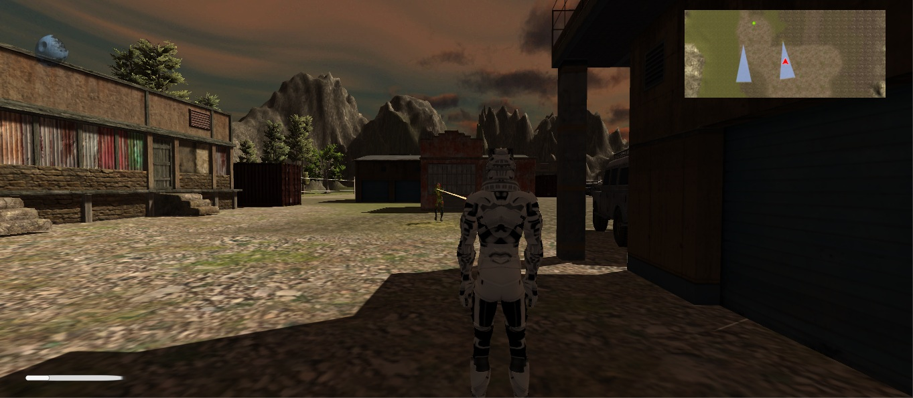

# Stealth-Game

Trabalho final da cadeira de Computação Gráfica Avançada.

Stealth-Game 3D feito em unity.

Objetivo: Coletar os planos da estrela da morte e sair da instalação sem ser visto

Movimentação: WASD e SHIFT

